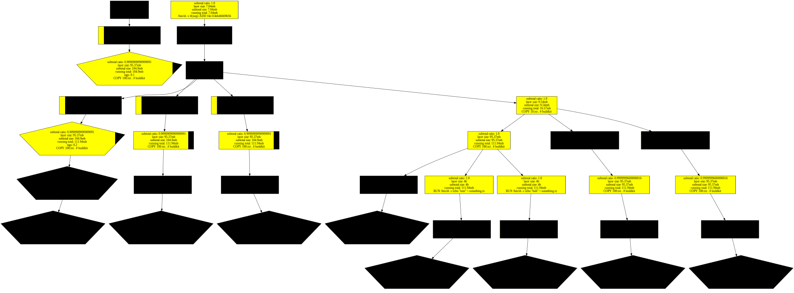
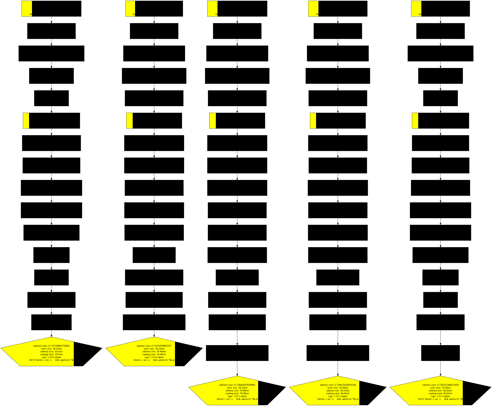

# Preamble

I have been looking for a way to objectively verify some of the best practices listed by docker (https://docs.docker.com/develop/develop-images/instructions/), in particular managing docker layers and hitting the 'cache' retrospectively, not while it is being built and seeing the 'CACHED' word.
```shell
[+] Building 0.9s (12/12) FINISHED
=> [internal] load .
=> => transferring context: 
=> [internal] load build definition from 
=> => transferring dockerfile:
=> [internal] load metadata for docker.io/library/alpine:3.19.
=> [internal] load build 
=> => transferring context: 
=> [stage-1 1/4] FROM docker.io/library/alpine:3.19.
=> CACHED [start 1/3] COPY 10.txt /output
=> CACHED [start 2/3] COPY 100.txt /output
=> [start 3/3] COPY file2.txt /output
=> CACHED [stage-1 2/4] WORKDIR /
=> [stage-1 3/4] COPY --from=start /output/ 
=> [stage-1 4/4] COPY file.txt 
=> exporting to 
=> => exporting 
=> => writing image sha256:
=> => naming to docker.io/library/test:v3
```

The nearest tool I could find is [dive](https://github.com/wagoodman/dive) but that looks at a single image level and optimising at a (possibly) file by file (or directory) level.

Instead, I want to look at a collection of tags for example my `test` image and tags 0.1, 0.2 and 1.0 and see how well the Dockerfile has been written and be able to answer questions like
* Where does each tag diverge from each other?
* Do I have my most frequently changing content near the end of my Dockerfile?


# Assumptions

* How the 'equivalent' image layers are matched between tags (a bit of guesswork)
  * This assumes the `docker history` api returns the layers in order
  * This assumes that each layer has only one parent
  * This assumption breaks when you use the [https://docs.docker.com/engine/reference/builder/#benefits-of-using---link](`COPY --link`) option (things may incidentally work because of the way graphviz identifies a node)
* Assumes only the addition of data, note: data doesn't actually get removed in between layers kind of like how git retains all history

# Things this does not do

* `docker pull` image, do that before running the tool
* install [graphviz](https://graphviz.org/download/)

# More questions to answer

~~Does any of this matter? Most people have ci/cd running their docker image build step (Jenkins / github actions etc)~~

~~Given that the job can run on any node, depending on many factors like frequency of build, whether builds workspaces are epheremal / workspace clean up frequency. ~~

~~does most of this mean that every build effectively runs with `--no-cache` and all of this is a moot exercise?~~

This is actually solved already with docker cache backends: https://docs.docker.com/build/cache/ 

# How to run
Need graphviz to be installed 

```shell
apt-get update && apt-get install -y graphviz
python -m venv venv

# if not done already
pip install -r requirements.txt
```

To run
```shell
python docker-size-visualization.py -rn test -v 0.1 -v 0.2 -v 0.3 -v 0.4 -v 0.5 -v 0.6 -v 0.7 -v 0.8
```


## Example

```shell
head -c 10485760 /dev/urandom > 10.txt
head -c 104857600 /dev/urandom > 100.txt
```

```Dockerfile
FROM alpine:3.19.0

WORKDIR /app

COPY 10.txt .
RUN echo "bob" > something.txt # Move this layer down
COPY 100.txt .

RUN rm 10.txt
RUN rm 100.txt
```

Note that the rm command size is 0 sized
```shell
ζ docker build --no-cache -t test:0.4 .
ζ docker history test:0.4
IMAGE          CREATED          CREATED BY                                      SIZE      COMMENT
6f52887b4bb0   7 minutes ago    RUN /bin/sh -c rm 100.txt # buildkit            0B        buildkit.dockerfile.v0
<missing>      25 minutes ago   RUN /bin/sh -c rm 10.txt # buildkit             0B        buildkit.dockerfile.v0
<missing>      26 minutes ago   COPY 100.txt . # buildkit                       100MB     buildkit.dockerfile.v0
<missing>      26 minutes ago   COPY 10.txt . # buildkit                        10MB      buildkit.dockerfile.v0
<missing>      26 minutes ago   WORKDIR /app                                    0B        buildkit.dockerfile.v0
<missing>      3 weeks ago      /bin/sh -c #(nop)  CMD ["/bin/sh"]              0B
<missing>      3 weeks ago      /bin/sh -c #(nop) ADD file:1f4eb46669b5b6275…   7.38MB
```

## Sample output

Go to `output/<repo name>/Digraph.gv.svg`

### Test

From the docker file example above 




### nginx

Comparison of nginx images

```shell
nginx:1.24.0-alpine
nginx:1.25.0-alpine
nginx:1.25.1-alpine
nginx:1.25.2-alpine
nginx:1.25.3-alpine
```



# How to read this?

Boxes = docker layers
Pentagon = has a tag associated with that layer

A concept of 'subtotal' is chain of nodes until it terminates or there are more than two children. The total is then is the total size in that chain.

Each node in the graph is a docker layer, the text
* subtotal ratio: The ratio this layer contributes to a subtotal
* layer size: the size that is reported by `docker history`
* subtotal size: The total size of the subtotal
* running total: The total size when rolling up all the parent layers (inclusive)
* Tags associated with the layer
* \<Command that generated the layer>


---

# Registry size checking

If you need additional assurances about layer sizes, then my recommendation is to 
* host your own registry e.g. https://distribution.github.io/distribution/
* Push your images incrementally to the registry
* Run the disk usage command where the layers are being stored
* See if that corroborates your understanding

```shell
docker run -p 5000:5000 -v $(pwd):/var/lib/registry registry:2.8.3
```
---
https://code.visualstudio.com/docs/python/python-tutorial

Once the dev container is open, Command Palette (Ctrl+Shift+P) -> Python: Select Interpreter

